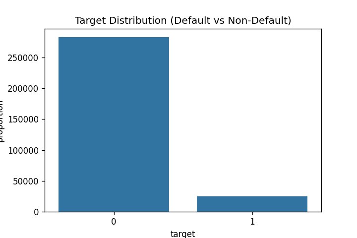
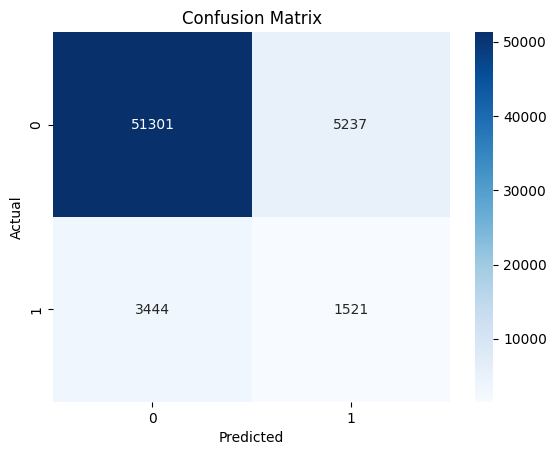
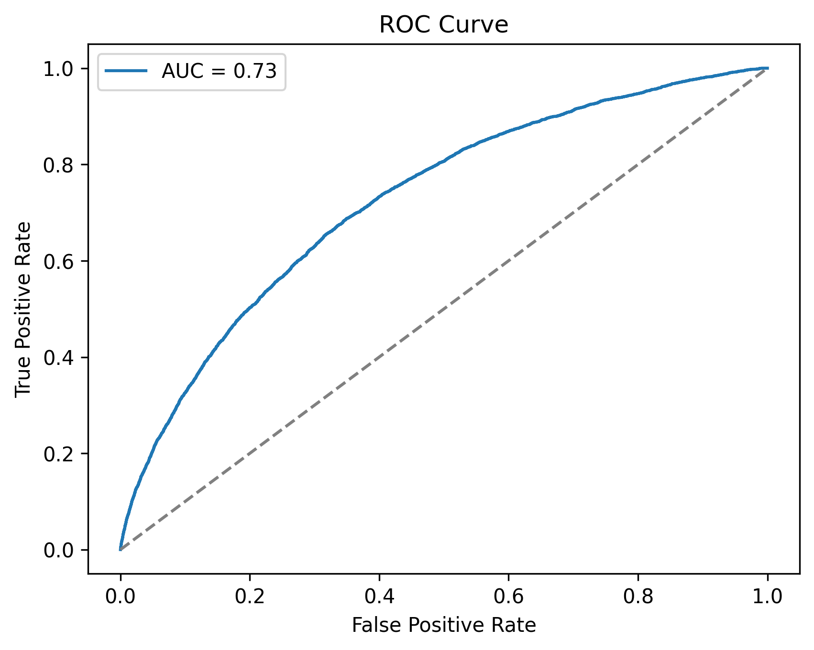

# Key findings: Borrowers asking for a higher loan amount and those having existing debt burdens were significantly more likely to default. 

## Author

- [@coder-red](https://www.github.com/coder-red)

## Table of Contents

  - [Borrowers asking for a higher loan amount and those having existing debt burdens were significantly more likely to default](#Borrowers-asking-for-a-higher-loan-amount-and-those-having-existing-debt-burdens-were-significantly-more-likely-to-default)

  - [Author](#author)
  - [Table of Contents](#table-of-contents)
  - [Business problem](#business-problem)
  - [Data source](#data-source)
  - [Methods](#methods)
  - [Tech Stack](#tech-stack)
  - [Quick glance at the results](#quick-glance-at-the-results)
  - [Lessons learned and recommendation](#lessons-learned-and-recommendation)
  - [Limitation and what can be improved](#limitation-and-what-can-be-improved)
  - [Repository structure](#repository-structure)


## Business problem

This model predicts if a borrower will pay back a loan or not. Lending institutions use this to make informed decisions on whether to approve a loan or not, interest rate to charge and risk management. 

## Data source

- [Kaggle Home Credit Default Risk](https://www.kaggle.com/competitions/home-credit-default-risk/data)


## Methods

- Data cleaning,preprocessing and Feature engineering to create predictive variables
- Exploratory data analysis
- Model training and evaluation with Logistic Regression, XGBoost, and LightGBM
- Optuna Hyperparameter tuning 
- SHAP and LIME Model explainability

## Tech Stack

- Python (refer to requirement.txt for the packages used in this project)
- Duckdb (aggregating and joining multiple csvs)
- Scikit-learn, XGBoost, LightGBM (machine learning )
- SHAP & LIME (model explainability)
- Optuna (Hyperparameter tuning) 


## Quick glance at the results

Target distribution between the features.



Summary bar of major features


Confusion matrix of LightGBM.



ROC curve of LightGBM.



Top 3 models (with default parameters)

| Model     	         |    AUC-ROC score     |
|----------------------|----------------------|
| LightGBM(tuned)      | 72.57% 	            |
| XGboost  (tuned)     | 72.42% 	            |
| Logistic Regression  | 69.80% 	            |


- ***The final model used is: LightGBM***
- ***Metrics used: Recall, AUC-ROC, AUC-PR, Precision,	F1-score, KS, Gini***


### Model Evaluation Strategy

**Primary Metric: ROC-AUC**
Credit risk data is very imbalanced, so ROC-AUC is best here as it measures how well the model does in separating defaulters from non defaulters

**Supporting Metrics: Precision, Recall, F1**
- **Recall** is critical as missing a high-risk borrower leads to real financial loss.
- **Precision** helps ensure we don’t wrongly reject too many good borrowers
- **F1** balances both precision and recall.


## Lessons Learned and Recommendations

**What I found:**
- Based on the analysis in this project it was found that loan amount, existing debt ratio, and age were the strongest predictors of default
- Tuning barely helped improve the model performance, for example XGBoost went from 0.722349 to 0.724171 AUC and it took over 30 minutes to tune
- For imbalanced data, AUC matters way more than accuracy, and the 0.5 threshold doesn't work (except for logistic regression), the optimal threshold was 0.121

**Recommendations:**
- Recommendation would be to focus more on the loan amount when deciding since they carry the most risk and also accept that precision will be low, you'll reject some good customers to catch defaults

## Limitations and What Can Be Improved
- Low precision means 80% of rejected applicants are false positives (lost customers)
- Hyperparameter tuning with Optuna takes 1+ hours
- Get more data 
- Monitor model performance over time and retrain quarterly

## Repository structure

<details>
  <summary><strong>Repository Structure (click to expand)</strong></summary>

```text

credit-risk-model/
├── assets/                          # Images used in the README (plots, diagrams, cover images)
│   ├── confusion_matrix_lgbm_tuned.png
│   ├── Credit_img.png
│   ├── roc_curve.png
│   ├── shap_summary_bar.png
│   └── target_dist.png
│
├── data/                            # All data (raw, processed, samples)
│   ├── data_sample/                 # small samples for quick loading 
│   │   ├── application_test_sample.csv
│   │   ├── application_train_sample.csv
│   │   ├── bureau_balance_sample.csv
│   │   ├── bureau_sample.csv
│   │   ├── credit_card_balance_sample.csv
│   │   ├── installments_payments_sample.csv
│   │   ├── POS_CASH_balance_sample.csv
│   │   └── previous_application_sample.csv
│   │
│   ├── processed/                   # cleaned + feature engineered datasets (not tracked in git)
│   │   ├── agg_main.csv
│   │   ├── cleaned_train.csv
│   │   ├── cleaned_val.csv
│   │   ├── feature_engineered_val.csv
│   │   ├── feature_engineered.csv
│   │   ├── target_train.csv
│   │   └── target_val.csv
│   │
│   └── raw/                         # original home credit datasets (not tracked in git)
│       ├── application_test.csv
│       ├── application_train.csv
│       ├── bureau_balance.csv
│       ├── bureau.csv
│       ├── credit_card_balance.csv
│       ├── installments_payments.csv
│       ├── POS_CASH_balance.csv
│       ├── previous_application.csv
│       └── README.md                # Download instructions
│
├── models/                          # Saved trained models (not tracked in git)
│   ├── LightGBM.joblib
│   ├── log_reg.joblib
│   └── XGBoost.joblib
│
├── notebooks/                       # Jupyter notebooks for analysis + modelling + interpretation
│   ├── 01_eda.ipynb
│   ├── 02_modelling.ipynb
│   └── 03_explainability.ipynb
│
├── results/                         # Generated plots and outputs
│   ├── EDA/                         # EDA visualisations
│   │   ├── CODE_GENDER_target_relationship.png
│   │   ├── CODE_GENDER_value_counts.png
│   │   ├── correlation_matrix.png
│   │   ├── missing_value_map.png
│   │   ├── NAME_CONTRACT_TYPE_target_relationship.png
│   │   ├── NAME_CONTRACT_TYPE_value_counts.png
│   │   ├── numeric_boxplots.png
│   │   ├── numeric_histograms.png
│   │   ├── OCCUPATION_TYPE_target_relationship.png
│   │   ├── OCCUPATION_TYPE_value_counts.png
│   │   └── target_dist.png
│   │
│   └── explainability/              # Model interpretation outputs
│       ├── lime_0.png
│       ├── lime_1.png
│       ├── lime_2.png
│       ├── roc_curve.png
│       ├── shap_dependence_age_years.png
│       ├── shap_dependence_avg_debt_ratio.png
│       ├── shap_dependence_CODE_GENDER.png
│       ├── shap_dependence_total_credit_requested.png
│       ├── shap_dependence_value_of_goods_financed.png
│       ├── shap_summary_bar.png
│       └── shap_summary.png
│
├── src/                             # Source code (Python modules)
│   ├── credit_risk_model/           # Package folder for imports
│   │   ├── __init__.py
│   │   ├── aggregations.py          # Aggregations
│   │   ├── config.py                # Paths and constants
│   │   ├── data_cleaning.py         # Cleaning + preprocessing logic
│   │   ├── data_ingestion.py        # DuckDB ingestion + joins
│   │   ├── feat_eng.py              # Feature engineering functions
│   │   └── model.py                 # Training + evaluation
│   │
│
├── .gitignore                       # Files/folders ignored by git
├── home_credit.duckdb               # DuckDB database file
├── pyproject.toml                   # Build system config 
├── README.md                        # Project overview
└── requirements.txt                 # Required python packages

</details>